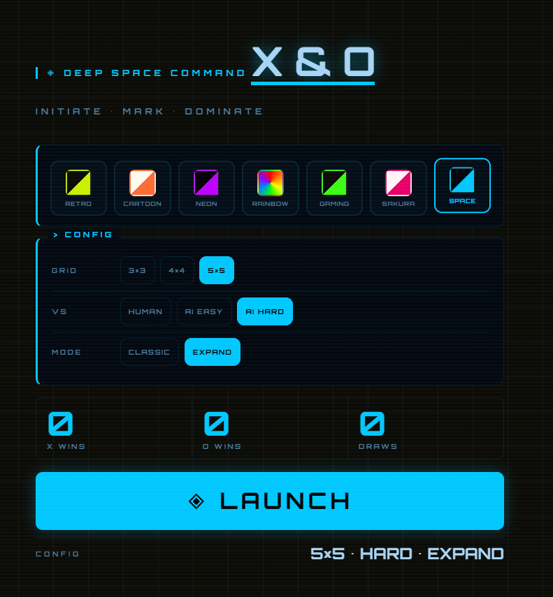
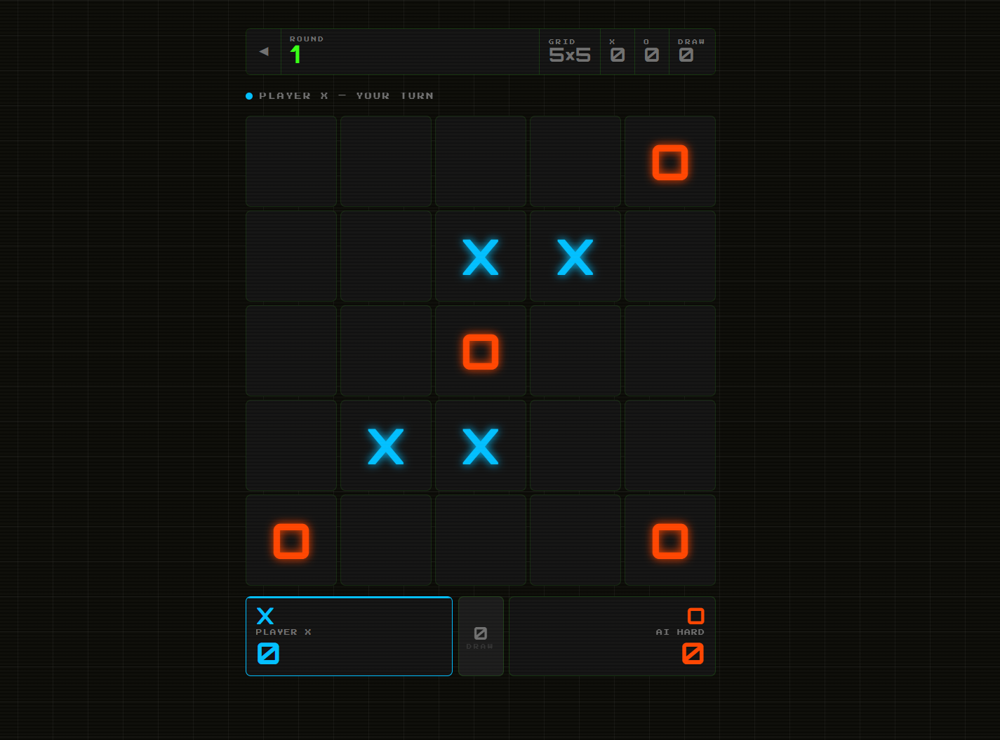

# 🎮 X & O — Tic-Tac-Toe

A responsive and customizable Tic-Tac-Toe game built with HTML, CSS, and JavaScript.

Play against another person or challenge the built-in AI across different board sizes, game modes, and visual themes.

## 🎮 Live Demo

The live demo is available through the **About** section on my profile.

---

## ✨ Features

- 🎯 **Multiple Board Sizes** — 3×3, 4×4, and 5×5
- 🤖 **AI Opponents** — Easy and Hard difficulty
- 👥 **Two-Player Mode** — Play against another person
- 🎨 **Multiple Visual Themes** — Retro, Cartoon, Neon, Rainbow, Gaming, Sakura, and Space
- 🔄 **Classic Mode** — Standard Tic-Tac-Toe gameplay
- 📈 **Expand Mode** — Board expands after a draw
- 🏆 **Score Tracking** — Track X wins, O wins, and draws
- 📱 **Responsive Design** — Designed for desktop and mobile screens
- ✨ **Animated UI** — Interactive board, winning-cell animations, transitions, and theme effects
- ⚡ **No Backend Required** — Runs entirely in the browser

---

## 📸 Screenshots

### 🏠 Home Screen



### 🎮 Gameplay



### 🎨 Another Theme


---

## 🕹️ Game Modes

### 👥 Human vs Human

Play locally with another player on the same device.

### 🤖 AI Easy

Play against an easier AI opponent with randomly selected moves.

### 🧠 AI Hard

Challenge a smarter AI opponent with strategic move selection.

---

## 📐 Board Sizes

| Board | Win Condition |
| --- | --- |
| 3×3 | 3 in a row |
| 4×4 | 4 in a row |
| 5×5 | 4 in a row |

---

## 🎨 Themes

The game includes seven different visual themes:

- 🕹️ Retro
- 🎨 Cartoon
- ⚡ Neon
- 🌈 Rainbow
- 🎮 Gaming
- 🌸 Sakura
- 🚀 Space

Each theme changes the game's visual appearance, colors, typography, borders, and effects.

---

## 🛠️ Built With

- HTML5
- CSS3
- Vanilla JavaScript
- Google Fonts

No frameworks or backend services are required.

---

## 🚀 Run Locally

Clone the repository:

```bash
git clone https://github.com/adicorexe/XandO.git
